# WMSDR — User Manual

**A panadapter, DSP receiver and control head for small QRP transceivers that provide I/Q and CAT.**

Version: draft for Cavaillon, October 2026
Author: Gabi Mihaila, YO4WM

---

## Table of contents

1. [What WMSDR is](#1-what-wmsdr-is)
2. [Hardware](#2-hardware)
3. [Software architecture](#3-software-architecture)
4. [Connecting a transceiver — the uSDX triband example](#4-connecting-a-transceiver--the-usdx-triband-example)
5. [CAT interface](#5-cat-interface)
6. [The screen, element by element](#6-the-screen-element-by-element)
7. [The button rows](#7-the-button-rows)
8. [The menu, tab by tab](#8-the-menu-tab-by-tab)
9. [Practical setup sequences](#9-practical-setup-sequences)
10. [Annexes](#10-annexes)

---

## 1. What WMSDR is

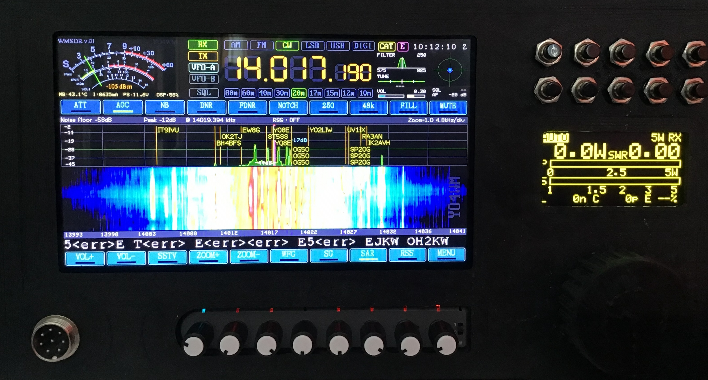

*Figure 1 — WMSDR front panel: main screen on 20 m with the RSS news ticker, the eight-knob encoder unit below, the ATU display (separate unit) on the right.*

WMSDR is a self-contained receive-side DSP and display unit. It does not generate RF and it
does not transmit. It takes the **baseband I/Q pair** from a quadrature-sampling detector
(a Tayloe mixer, in practice) and a **CAT serial link** from the same radio, and turns those
two into everything a small QRP rig usually cannot afford to have:

- a real **panadapter and waterfall**, 8 / 32 / 48 / 96 kHz of visible spectrum, with a
  zoom-FFT down to a narrow slice;
- **demodulation in software** — LSB, USB, CW, AM, FM, and the digital-mode passbands —
  independent of what the rig's own audio chain does;
- **noise tools** that a QRP rig has no room for: an impulse noise blanker, an LMS
  adaptive noise reducer, an automatic notch, and a frequency-domain (spectral) noise
  reducer, all switchable individually so they can be compared on the same signal;
- a **calibrated S-meter**, per band;
- a **CW decoder** with an ML classifier;
- **tap-to-tune**: touch a signal on the spectrum or the waterfall and the rig is retuned
  to it over CAT.

The design intent is explicit: **enhance a QRP transceiver you already own**, rather than
replace it. The rig keeps the RF, the filtering, the PA and the transmit chain. WMSDR
adds the eyes and the ears.

The reference rig for development is the **uSDX triband** by Barb, WB2CBA
(<https://antrak.org.tr/blog/usdx-triband-sdr-all-mode-qrp-transceiver/>), which brings out
both an I/Q pair and a TS-480-compatible CAT port. Anything that does the same will work.

> **Requirements on the host rig**
> 1. A baseband **I/Q output** — two audio-level channels, in quadrature, at line level.
> 2. A **CAT serial port** speaking the Kenwood TS-480 dialect (at minimum `FA`, `MD`).
> 3. A common ground and, ideally, a supply rail WMSDR can share.

---

## 2. Hardware

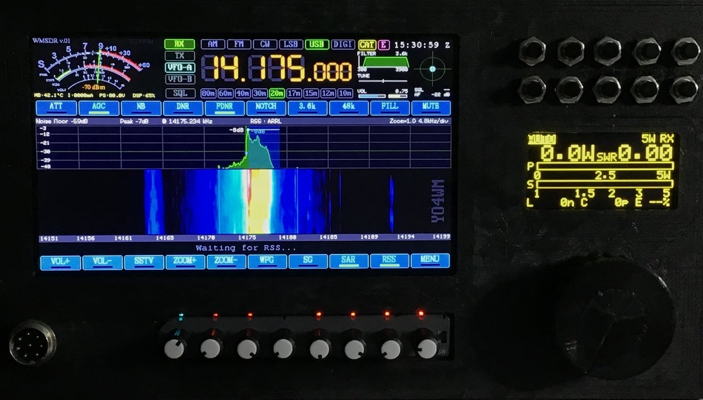

*Figure 2 — The enclosure front: 800×480 touch panel, eight-encoder unit, tuning knob, ATU display (separate unit).*

| Item | Detail |
|---|---|
| Processor | Espressif **ESP32-S3**, dual core at 240 MHz, with 8 MB PSRAM |
| Codec | **Wolfson WM8731** stereo audio codec — ADC for I/Q in, DAC for audio out |
| Codec clock | 12.288 MHz crystal (this is what fixes the available sample rates) |
| Sample rates | **8 / 32 / 48 / 96 kHz**, switched on the fly. This is also the visible span. |
| Display | **800 × 480** RGB parallel panel, 16-bit colour, backlight on GPIO 45 |
| Touch | **GT911** capacitive controller, I²C on GPIO 48 / 47 |
| CAT | UART1, TX on **GPIO 42**, RX on **GPIO 1**, 9600 / 38400 / 115200 baud |
| Storage | ESP32 NVS (flash) for all settings, calibration, and colours |
| Wireless | Wi-Fi for SNTP time; **ESP-NOW** link to a companion XIAO remote |
| Control knobs (optional) | **M5Stack Unit 8Encoder** — eight push-knobs, a toggle switch and nine RGB LEDs, on the codec's I²C bus (address 0x41), powered from **5 V**. See §8.10. |
| Toolchain | ESP-IDF 5.5.3, Xtensa GCC |

The I/Q pair enters the WM8731 line inputs as a stereo signal — I on one channel, Q on
the other. Sideband selection therefore depends on the **sense** of that pair, which
WMSDR detects automatically (see the STATUS tab, §8.12) rather than requiring you to
get the wiring right first time.

Demodulated audio leaves through the WM8731 DAC.

> The schematic for the interface board — I/Q input conditioning, CAT level translation,
> supply — is in [Annex A](#annex-a--interface-board-schematic).

---

## 3. Software architecture

Everything runs bare-metal on FreeRTOS, with a strict division between the two cores.

**Core 0 — the real-time audio pipeline**

1. `i2s_aquire_task` reads 1024 stereo I/Q samples from the WM8731.
2. `processing_task` does the work: DC removal → noise blanker → adaptive NR →
   1024-point FFT for the display → demodulation (mode dependent) → decimation to the
   audio rate → filtering and EQ → AGC → back to int16.
3. CAT receive and parsing.

**Core 1 — everything the operator sees**

`out_to_dac_task` feeds the DAC, and fourteen independent sprite tasks each own one
rectangle of the screen: spectrum, waterfall, S-meter, VFOs, CW text, status icons, and
so on. Each repaints only when its own data changes, which is what keeps a 800×480 panel
looking live on a microcontroller.

Because the two cores are separated this way, a heavy display setting cannot stall the
audio, and a heavy DSP setting cannot make the screen tear.

**Demodulation**: SSB uses Hilbert-transform phasing; CW uses a narrow bandpass centred
on the sidetone pitch feeding a Goertzel detector and an ML classifier; AM uses envelope
detection; FM uses a discriminator with a noise-derived squelch.

---

## 4. Connecting a transceiver — the uSDX triband example

The uSDX triband (WB2CBA) is the rig WMSDR has been developed and measured against.

**Wiring**

| uSDX | WMSDR | Note |
|---|---|---|
| I output | WM8731 LINE IN, left | via the interface board |
| Q output | WM8731 LINE IN, right | via the interface board |
| CAT TX | GPIO 1 (RX) | level-shifted on the interface board |
| CAT RX | GPIO 42 (TX) | idem |
| GND | GND | one common ground, star point at the rig |

**First power-up**

1. Set the uSDX CAT baud rate and WMSDR's `CAT BAUD` (DSP tab) to the same value.
   115200 is the default here.
2. Open the menu → **STATUS**. `MODE / BAND` and `FREQUENCY` should be following the rig
   within a fraction of a second. If they do not move, the CAT link is not up.
3. On the same tab, `I/Q SENSE` will read **STRAIGHT (I,Q)** or **SWAPPED (Q,I)**. Either
   is fine — WMSDR compensates. What matters is that it is not stuck on `checking...`.
4. Verify the orientation on the air: tune the rig **down** in frequency and watch a
   carrier on the spectrum. It should move **right**. If it moves left, press
   **RE-CHECK I/Q** on the STATUS tab.
5. Calibrate the S-meter for the band you are on — see the [CALIB tab](#88-calib-tab).

**A known uSDX behaviour worth stating up front**

While its own encoder is turning, the uSDX largely stops answering CAT — measured at
around 20 replies per second when idle, dropping to 1–2 per second while tuning. The
frequency readout therefore lags the knob on the rig, and then catches up when you stop.
This is the rig, not the display path. WMSDR deliberately does **not** poll harder to
compensate, because asking more often makes it worse: the uSDX parses CAT in the same
loop that reads its encoder.

---

## 5. CAT interface

WMSDR speaks the **Kenwood TS-480** CAT dialect over UART1, 8-N-1, at 9600, 38400 or
115200 baud (selected on the DSP tab, applied live).

It is a **client**: it polls the rig and follows it. It sends only one command that
changes the rig's state — the frequency set behind tap-to-tune.

### Commands WMSDR sends

| Command | Rate | Purpose |
|---|---|---|
| `FA;` | 10 Hz | Get VFO A frequency — the one the operator watches |
| `FB;` | ~0.5 Hz | Get VFO B frequency |
| `FR;` | ~0.5 Hz | Get the receive VFO (0 = A, 1 = B, 2 = memory) |
| `MD;` | 1 Hz | Get the operating mode |
| `FA` + 11 digits + `;` | on demand | **Set** frequency — tap-to-tune only |

### Replies WMSDR understands

| Reply | Format | Effect |
|---|---|---|
| `FA` | `FA` + 11 digits + `;` (14 chars) | VFO A frequency. Becomes the panadapter LO when receiving on A. |
| `FB` | `FB` + 11 digits + `;` (14 chars) | VFO B frequency. Becomes the LO when receiving on B. |
| `FR` | `FR` + 1 digit + `;` (4 chars) | Receive VFO. Drives the VFO-A / VFO-B icons and the tap-to-tune target. |
| `MD` | `MD` + 1 digit + `;` (4 chars) | Operating mode — see the table below. |

**Mode codes (`MD`)**

| Code | Mode | WMSDR label |
|---|---|---|
| 0 | — | NONE |
| 1 | LSB | LSB |
| 2 | USB | USB |
| 3 | CW | CW-U |
| 4 | FM | FM |
| 5 | AM | AM |
| 6 | FSK | DIGI-U |
| 7 | CW reverse | CW-R |
| 8 | TUNE | NONE |
| 9 | FSK reverse | DIGI-L |

### Implementation notes worth knowing

- **Frames are reassembled.** A reply routinely arrives split across two UART reads, and
  several replies routinely arrive in one. WMSDR accumulates bytes and emits every
  complete `;`-terminated frame, keeping any partial tail for the next read. Nothing is
  flushed on a split.
- **Digit fields are validated.** A frame with the right length and prefix but junk in the
  digit field is rejected rather than painted. The rig is polled continuously, so the next
  good reply arrives within milliseconds and the display simply holds.
- **Tap-to-tune always addresses `FA`**, even when the rig reports it is receiving on
  VFO B. On the uSDX, `FA` addresses the *active* VFO and an `FB` set is silently ignored.
  A build flag (`CAT_SET_FREQ_PER_VFO`) exists for a genuine TS-480, which does implement
  `FB` as a separate VFO.
- **Poll backoff.** After 5 seconds of complete silence, WMSDR drops to one probe per
  second. It deliberately does *not* use the 1-second icon timeout for this, because a
  connected rig goes quiet that long by itself while being tuned.
- **What WMSDR does not do:** it never keys the rig, never sets mode, never sets VFO, and
  never writes memories.

---

## 6. The screen, element by element

The panel is 800 × 480. From top to bottom:

```
 0    ┌───────────────┬────┬────────────────────────┬─────────┬──────┐
      │  S-METER      │RX  │  MODE / STATUS (UPSA)  │ INFO    │ ICONS│  0..23
      │               │TX  ├────────────────────────┤ ICONS   ├──────┤
 32   │               │VFO-A│  VFO-A  /  VFO-B      │ RX INFO │ I/Q  │ 24..96
      │               │VFO-B│                       │         │ CONST│
 98   │               │    │  BAND ROW (UPSB)       │         ├──────┤
      │               │SQL │                        │         │ DSP  │ 97..120
 127  ├───────────────┴────┴────────────────────────┴─────────┴──────┤
      │  TOP BUTTON ROW — receive controls                            │ 127..157
 162  ├───────────────────────────────────────────────────────────────┤
      │  BAND EDGE STRIP                                              │ 162..177
 178  ├───────────────────────────────────────────────────────────────┤
      │  SPECTRUM                                                     │ 178..268
 270  ├───────────────────────────────────────────────────────────────┤
      │  WATERFALL                                                    │ 270..405
 407  ├───────────────────────────────────────────────────────────────┤
      │  FREQUENCY SCALE                                              │
 424  ├───────────────────────────────────────────────────────────────┤
      │  CW DECODER TEXT  /  RSS TICKER                               │
 450  ├───────────────────────────────────────────────────────────────┤
      │  BOTTOM BUTTON ROW — display and system controls              │ 450..480
      └───────────────────────────────────────────────────────────────┘
```

### 6.1 S-meter (top left)

An analogue-style needle with a spring-and-damping model, repainted at 15 Hz. It reads
S1–S9 and S9+dB, and it is **calibrated per band** — the mapping from raw level to
S-number comes from the two capture points you take on the CALIB tab. Uncalibrated, it is
indicative only. The foot line carries the CPU die temperature.

*Levers:* [CALIB tab](#88-calib-tab) — NOISE REF, SIGNAL REF, CAPTURE NOISE, CAPTURE SIGNAL.

### 6.2 RX / TX / VFO / SQL column

Five stacked lamps between the S-meter and the mode row.

- **RX** / **TX** — receive and transmit state. Green and red respectively; these two
  colours are deliberately *not* themeable, because they are a safety convention. While
  **TX ARM** is on (TX tab, §8.11) the TX lamp has an **orange outline**: the radio may
  transmit. It turns red while PTT is keyed.
- **VFO-A** / **VFO-B** — which VFO the rig says it is receiving on, from the `FR;` reply.
- **SQL** — the FM squelch. Lit means the gate is **open**, i.e. a signal is holding the
  channel: it is a *busy* lamp, not a *muted* lamp. It only claims to mean anything in
  FM with a non-zero level.

*Levers:* **tap the SQL lamp** to engage/disengage the squelch (FM only — the tap is
ignored in every other mode). The level itself is `FM SQUELCH` on the [AUDIO tab](#85-audio-tab).

### 6.3 Mode row (UPSA) and band row (UPSB)

The mode label as reported by CAT (LSB / USB / CW-U / CW-R / AM / FM / DIGI-U / DIGI-L),
and the amateur band the current frequency falls in — 160 m through 10 m, IARU Region 1
edges.

### 6.4 VFO display

VFO-A and VFO-B in large digits, straight from the CAT digit fields. The receive VFO is
highlighted.

### 6.5 Info icons (top right, 615–799 × 0–23)

- **U** — the CAT/UART link. Lit while frames are arriving; goes dark after 1 second of
  silence.
- **E** — the ESP-NOW link to the companion XIAO remote. The companion also brings the time FT8
  needs, and serves decoded charts and FT8 decodes to a browser (§7.4).
- **UTC** — live time from SNTP over Wi-Fi.

### 6.6 RX info panel (615–717 × 24–123)

Three readouts in one column:

- the **receive passband**, drawn from the live DSP filter edges — not from a table, so it
  always shows what the audio chain is really doing;
- the **CW tuning aid**, which shows how far the received tone sits from your chosen CW
  pitch;
- the **volume** bargraph (VOL, 0.05 … 1.00).

The panel keeps updating while the menu or the decoder window is open — it sits above the
overlay area, so you can watch the audio react while you change a setting.

### 6.7 I/Q constellation (726–798 × 24–96)

A 73 × 73 scatter plot of the incoming I/Q pair with a centre crosshair. A clean circle
means balanced I and Q; an ellipse means gain imbalance; a tilted ellipse means phase
error. It is the fastest way to see that the front end is healthy.

### 6.8 DSP info (726–798 × 97–120)

A compact `SQL` / `AF` readout — the squelch state and the audio output level. `AF` is in dB,
where **0 dB is the point the output clips**. On a clean voice signal the peaks sit around
**−6 dB**; if `AF` climbs to −2 … 0 dB you will hear distortion that sounds like reverb or
echo — lower `AGC TARGET` or `VOLUME` (see §8.5). Like the RX info panel, it stays live with
the menu open.

### 6.9 Spectrum (178–268)

The panadapter. Full width, 800 px, mapped across the current span (8 / 32 / 48 / 96 kHz
divided by the zoom factor).

What can be drawn on it, all independently switchable:

| Layer | What it is |
|---|---|
| **Live trace** | The current FFT frame, smoothed |
| **Noise floor** | A slow per-bin average — the band's own floor |
| **Trail** | A decaying trace, so a transient leaves a visible tail |
| **Peak hold** | The maximum each bin has reached, decaying slowly |
| **Area fill** | Filled to the baseline instead of a bare line |
| **Gradient** | Colour by amplitude instead of one flat colour |
| **Passband mask** | A translucent band showing the receive passband, wired to the live filter edges |
| **Centre / tuned / spectrum peak markers** | Three optional markers |

*Levers:* the whole [DISPLAY tab](#81-display-tab), the [SPECTRUM tab](#82-spectrum-tab),
the [TRACE tab](#83-trace-tab), and the `FILL`, `SG`, `SAR`, `ZOOM+/-` buttons.

**Tap-to-tune.** The spectrum and the waterfall behave as one tuning surface. Press, drag
to position the cursor, release — the rig is retuned to the frequency under your finger,
rounded to `TUNE SNAP`. The CAT set is fired **only on release**, never while dragging.
If `FREQ TOUCH` is off, the cursor still tracks your finger (so the panel does not read as
dead) but no command is sent.

### 6.10 Waterfall (270–405)

135 rows of history. Each bin is coloured against **its own tracked noise floor**, not
against one global level — which is what lets a weak signal stay visible next to a strong
one. Seven palettes, cycled with `WFG`.

*Levers:* `WATERFALL SPEED`, `WF BLACK LEVEL`, `WF CONTRAST`, `WF FLOOR BLEND` on the
[SPECTRUM tab](#82-spectrum-tab); `WF FLOOR` per band on the [CALIB tab](#88-calib-tab).

> Changes to the waterfall are **not** visible while the menu is open — the menu covers
> that region and its repaint is suppressed. Close the menu and let the old history scroll
> off (about 3 s at zoom ×1, about 23 s at ×8) before judging a change.

### 6.11 Frequency scale

The absolute frequency under each part of the spectrum, computed from the CAT LO plus the
offset, with the sideband sense taken into account.

### 6.12 CW decoder / RSS line (424–449)

One line of text. In CW it carries the decoded characters; otherwise it can run an RSS
ticker, cycled with the `RSS` button.

*Levers:* the whole [CW tab](#87-cw-tab).

---

## 7. The button rows

Two rows of ten. Buttons with an LED bar are toggles and the bar shows the state; the
others are momentary and step through a list, with the label acting as the readout.

### 7.1 Top row — receive controls (y 127–157)

| Button | Type | What it does |
|---|---|---|
| **ATT** | toggle | Input attenuator |
| **AGC** | toggle | Audio AGC. With it off the chain falls back to the plain `VOLUME` trim, which at its maximum of 1.0 is quiet — that is expected, not a fault. `VOLUME` is an attenuator only, so it cannot make up the difference. |
| **NB** | toggle | Wideband impulse noise blanker, applied to I/Q **before** decimation. Threshold on the AUDIO tab. |
| **DNR** | toggle | Adaptive (NLMS) noise reduction — keeps what is *periodic*. Good on hiss under a voice. |
| **FDNR** | toggle | Frequency-domain (spectral) noise reduction — estimates noise per FFT bin. A **different** tool from DNR, not a stronger one. Ignored in CW. Which of the three engines it runs is set by FDNR ALGO on the AUDIO tab; the default needs no attention. |
| **NOTCH** | toggle | Automatic notch — the same NLMS predictor as DNR, but keeping the *error* instead of the prediction. Kills a steady carrier. |
| **FILTER** | momentary | Steps the receive bandwidth. The list is per mode class: **SSB** 3600 / 2800 / 2400 / 1800 / 1200 Hz; **CW** 1000 / 500 / 250 / 100 / 50 Hz; **AM** 4500 / 3500 / 2500 Hz. Each class remembers its own selection. The label *is* the readout. |
| **I/Q** | momentary | Cycles the sample rate, and therefore the visible span: 8k → 32k → 48k → 96k. Re-clocks I²S, reprograms the WM8731, and is remembered across reboots. |
| **FILL** | toggle | Spectrum fill-to-baseline |
| **MUTE** | toggle | Mutes the output, gated after the AGC so unmuting does not arrive at full blast. Not persisted — a rig that boots muted reads as broken. |

> **DNR and FDNR are switched separately on purpose.** The point of having both is to A/B
> them on the same signal, which is why they sit next to each other on the row.

### 7.2 Bottom row — display and system (y 450–480)

| Button | Type | What it does |
|---|---|---|
| **VOL+** / **VOL−** | momentary, repeat | Audio level, 0.05 … 1.00 in steps of 0.05. The same value as `VOLUME` on the AUDIO tab — an open menu shows the change immediately. |
| **SSTV** | toggle | Opens and closes the decoder window — SSTV, WeFax, RTTY, PSK, FT8 (§7.3). Its LED shows the window is open. |
| **ZOOM+** / **ZOOM−** | momentary | Zoom-FFT factor, 1 to 8. Real narrow bins, not interpolation. The S-meter deliberately stays on the main spectrum. |
| **WFG** | momentary | Cycles the waterfall palette (7 entries) |
| **SG** | toggle | Spectrum gradient — colour by amplitude vs. one flat colour |
| **SAR** | toggle | Spectrum Auto dB Range — lets the display window track the signal automatically |
| **RSS** | momentary | Cycles the RSS ticker feed; LED off when the feed is OFF |
| **MENU** | momentary | Opens and closes the settings overlay |

### 7.3 The decoder window (SSTV / WeFax / RTTY / PSK / FT8)

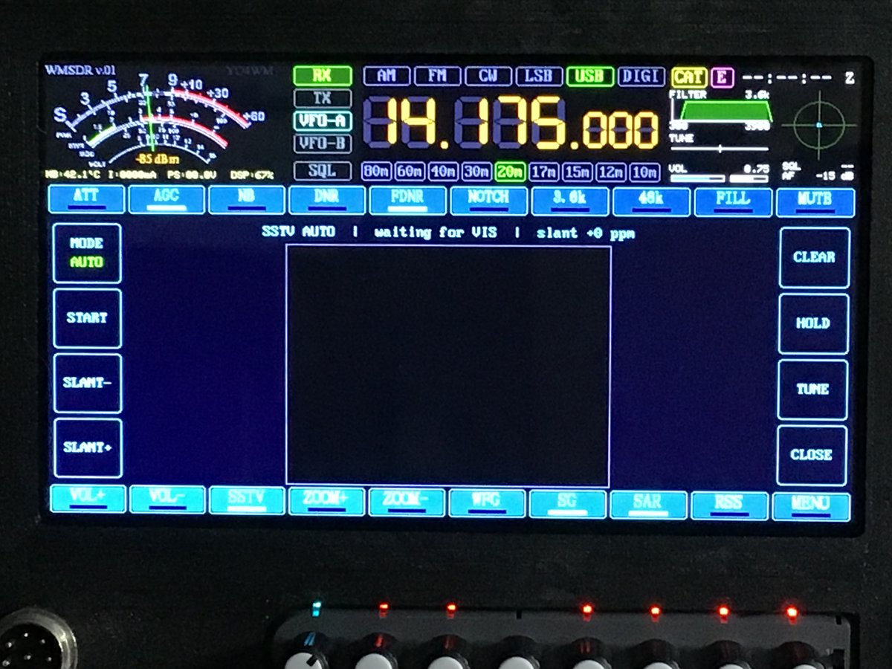

*Figure 7.3 — The decoder window, MODE AUTO, waiting for an SSTV VIS header. Mode and actions on the left, CLEAR / HOLD / TUNE / CLOSE on the right.*

A receive-and-display decoder for slow-scan TV pictures, HF weather charts, RTTY and PSK31/PSK63
text, and FT8. It opens
in the same place as the menu and replaces it — the two are never open together. Nothing is stored
on the radio: the board has no SD card, so a picture lasts until it is cleared or scrolls away.
WeFax charts and FT8 decodes can be saved from a browser through the companion (§7.4).

> **RTTY, WeFax, PSK31 and FT8 are verified on the air.** **SSTV is not yet verified on a real
> transmission** — it passes its built-in self-test (see *Self-test* below).

**Layout.** Four buttons in a column on each side, the picture in the middle, a status line
above it.

| Left column | Right column |
|---|---|
| **MODE** — what to decode; the label shows the current choice | **CLEAR** — blank the picture and wait again |
| **START** — start without waiting for a header, or stop | **HOLD** — keep the picture; LED lit while on |
| **SLANT−** — trim the timing by −20 ppm | **TUNE** — tone bar instead of the picture; LED lit while on |
| **SLANT+** — trim the timing by +20 ppm | **CLOSE** — close the window (the SSTV button does too) |

**MODE** cycles through:

| Setting | Decodes |
|---|---|
| **AUTO** | SSTV; the VIS header picks Martin 1 or Martin 2 |
| **M1** / **M2** | SSTV; the VIS header still decides — the setting is what START uses without one |
| **WEFAX** | HF radiofax, 120 lines/min, IOC 576 |
| **TEST** | self-test: plays a synthetic Martin 1 picture through the decoder |
| **RTTY** | RTTY text (Baudot); speed and shift from the preset |
| **PSK** | PSK31 / PSK63 text (Varicode); pick the signal on the audio waterfall |
| **FT8** | FT8, every 15 s UTC slot; a list of decodes |

**Span.** SSTV needs 12 kHz audio. If the span is 8k or 32k, opening the window switches it to
**48k** and closing puts it back. The switch is not saved — a reboot comes up on your own span.
If you press I/Q while the window is open, your choice stands. At 96k nothing changes.

**The audio is untouched.** The decoders take a copy of the audio after the FILTER bandwidth and
before NR, notch and AGC, so those settings do not affect decoding, and you keep listening
normally.

#### TUNE — the tone bar

A bar from 1000 to 2500 Hz with markers at **1200** (sync, red), **1500** (black), **1900** (SSTV
header, yellow) and **2300** (white). The green needle is the measured tone and the grey band its
spread over the last half second, with the frequency and level underneath. It greys out when
there is no tone.

- **SSTV** as it starts: the needle rests on **1900**, then darts between 1200 and 1500–2300.
- **A weather chart**: swings between **1500** and **2300**.
- **Voice**: wanders and the grey band breathes — expected, voice is not a single tone.

#### Receiving SSTV (Martin 1 / Martin 2)

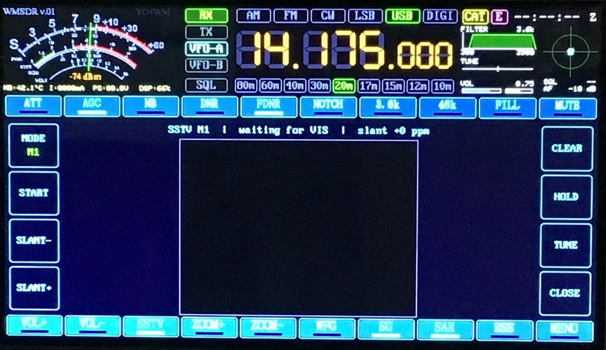

*Figure 7.3a — MODE M1 (Martin 1) selected, waiting for a signal.*

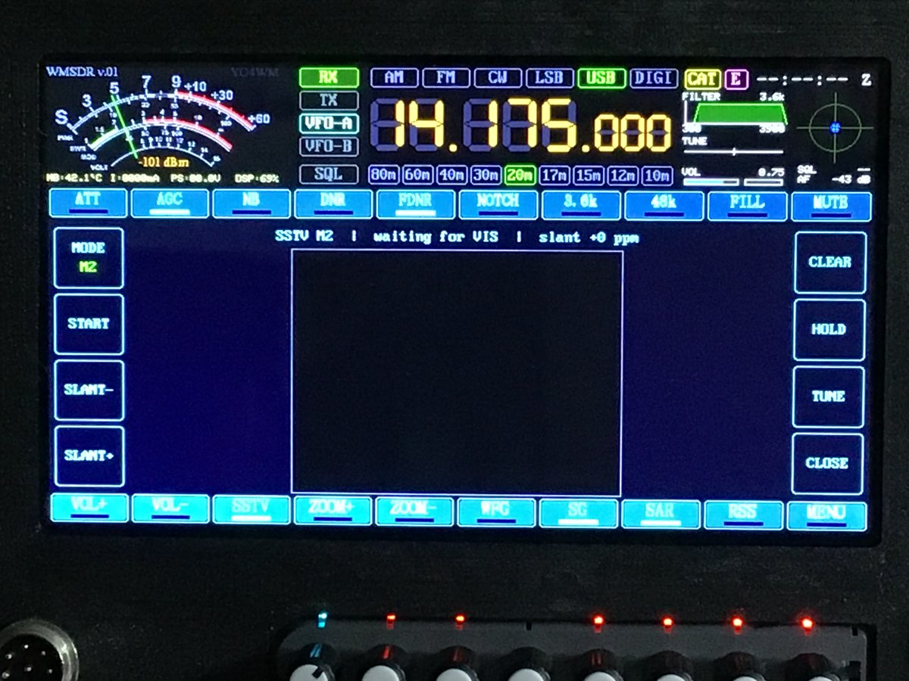

*Figure 7.3b — MODE M2 (Martin 2) selected, waiting for a signal.*

1. Tune the rig as for voice — USB on 20 m and up, LSB on 40 and 80 m.
2. Open the window, MODE **AUTO**, HOLD off.
3. When a picture starts, the header is decoded (`VIS 44 -> M1` in the serial log) and the
   picture builds from the top: **114 s** for Martin 1, **58 s** for Martin 2.
4. The status line shows `RX line n/256`, how many sync pulses were found, and the **slant** in
   ppm. The slant is corrected automatically: it moves over the first few dozen lines, then
   settles.
5. At the end: `complete`. The picture stays until the next header replaces it — press **HOLD**
   to keep it.

If the header is missed (weak or fading signal), press **START** as the picture begins; it finds
the line sync on its own. If the image leans, **SLANT±** trims it. After 12 lines without sync
the picture stops with `signal lost` and keeps what it has.

#### Receiving WeFax

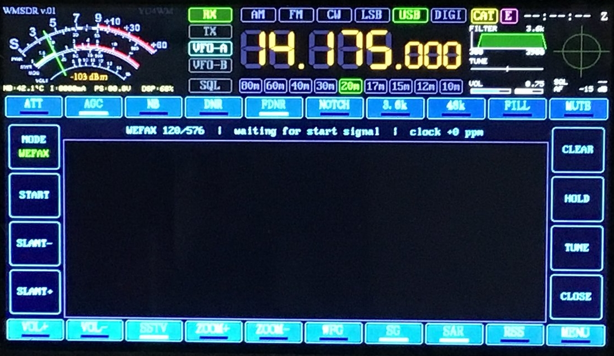

*Figure 7.3c — MODE WEFAX selected, waiting for a chart.*

1. Tune **USB, 1.9 kHz below the published carrier** (see *Where to listen*). On TUNE, a chart
   swings between 1500 and 2300.
2. Open the window, MODE **WEFAX**.
3. A chart begins with a 5 s start signal (`start signal detected`), then 30 s of phasing
   (`phasing n/56`). Phasing measures the **clock error** and lines the chart up; the status
   line then shows `RX line n` and the clock in ppm.
4. The chart appears as a **strip scrolling upwards**, newest row at the bottom. Each row is
   three chart lines, which keeps the proportions. It ends on the stop signal
   (`chart complete`).

**Tuned in mid-chart?** Press **START**. Lines are received without phasing, so the chart comes
out wrapped sideways: tap the strip where the chart's left margin appears, and that column
becomes the left edge. Worth knowing about tapping:

- only rows from then on move — rows already on screen stay as they were;
- it shifts one way only: to move the margin a little to the right, tap near the right end;
- a fingertip is several columns wide — tap again if it lands slightly off;
- straighten any lean with **SLANT±** first, or the margin drifts away again;
- taps count only while a chart is being received, and any stray tap on the strip shifts it.

**HOLD** freezes the strip while reception continues; **CLEAR** blanks it and waits for the next
start signal.

> **Verified example — DWD Pinneberg, 7880 kHz:** dial **7878.1 kHz USB**, MODE **WEFAX**. Charts
> received cleanly and saved from the browser (§7.4).

#### Receiving RTTY

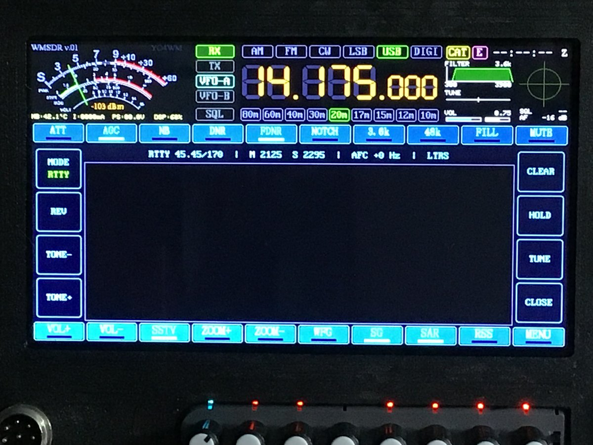

*Figure 7.3d — MODE RTTY selected, waiting for a signal.*

Radioteletype text — amateur RTTY and weather bulletins — in an 80 × 16 console that scrolls
upwards. In the RTTY modes three buttons change their job:

| Button | In RTTY |
|---|---|
| **REV** (START) | swap mark and space; LED lit while on |
| **TONE−** / **TONE+** (SLANT−/+) | move the expected tone pair by 10 Hz |
| **CLEAR** | clear the text |
| **HOLD** | freeze the console; decoding continues |
| **TUNE** | tone bar with **M** (mark) and **S** (space) markers at the live tone pair |

**Tap the status line** to step through the speed / shift presets:

| Preset | Used by | Mark / space audio |
|---|---|---|
| **45.45/170** | amateur RTTY (default) | 2125 / 2295 Hz |
| **50/170** | some utility and amateur stations | 2125 / 2295 Hz |
| **50/450** | DWD weather bulletins | 1675 / 2125 Hz |
| **75/170** | faster amateur / utility traffic | 2125 / 2295 Hz |
| **50/850** | older wide-shift utility stations | 1475 / 2325 Hz |

The status line reads, for example, `RTTY 50/450 | M 1714 S 2164 | AFC +39 Hz | LTRS`.

1. Tune USB so the two tones sit near the **M** and **S** markers on TUNE — the AFC then pulls
   them in, up to ±200 Hz, and the status line shows how far (`AFC +n Hz`).
2. Pick the preset by tapping the status line.
3. Text appears as it is received; each finished line is also written to the serial log.
4. Nothing but garbage on a clean signal? Press **REV** — stations differ in which tone is
   mark, and changing sideband swaps them too.

Decoding details: letters/figures shifts are followed, a space returns to letters (the usual
convention), and a character with a bad start or stop bit, or too weak, is dropped rather than
printed as rubbish.

> **Verified example — DWD Pinneberg, 10100.8 kHz:** dial **10098.9–10099.1 kHz USB**, preset **50/450**,
> **REV off**, AFC settled at **+39 Hz**. Clean copy of the station's own bulletin, including
> its frequency list. An AFC offset of that size on every station points at the rig's frequency
> calibration; **TONE+** can pre-set it.

#### Receiving PSK31 / PSK63

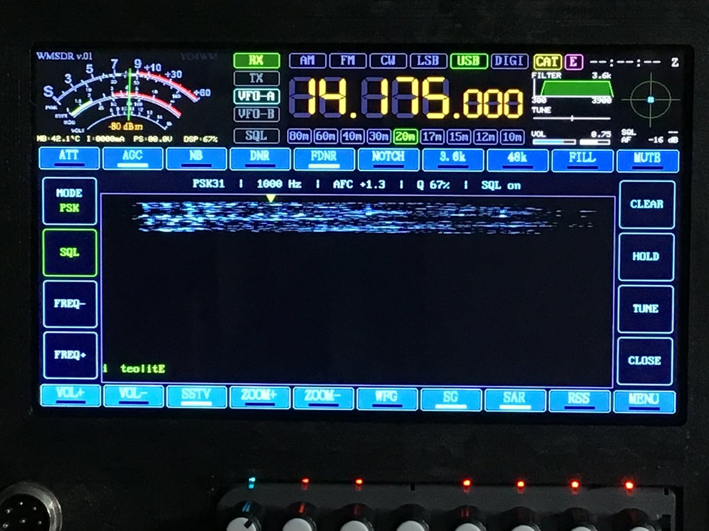

*Figure 7.3e — MODE PSK selected, waiting for a signal.*

Keyboard-to-keyboard PSK text. Several signals usually share the same 3 kHz of audio, so this mode
shows an **audio waterfall** (0–3000 Hz) under the status line, a green marker above it for the
signal being decoded, and the last 12 lines of text below.

| Button / area | In PSK |
|---|---|
| **SQL** (START) | squelch; LED lit while on (default on) — drops characters when the signal quality is below 60 % |
| **FREQ−** / **FREQ+** (SLANT−/+) | move the decoded frequency by 5 Hz |
| **CLEAR** | clear the text |
| **HOLD** | freeze the text; decoding continues |
| **TUNE** | tone bar with a **PSK** marker at the decoded frequency |
| tap the **waterfall** | decode the signal under your finger |
| tap the **status line** | switch between **PSK31** and **PSK63** |

The status line reads, for example, `PSK31 | 1000 Hz | AFC +2.4 | Q 92% | SQL on`.

1. Tune USB to the PSK activity — the traces appear as thin vertical lines on the waterfall.
2. Tap a trace. The AFC pulls in the last few hertz (up to ±30 Hz) while the quality is good.
3. **Q** is the signal quality: above ~60 % text prints; a clean signal reads 90 % or more.
4. Only noise with SQL off, or nothing with SQL on? The marker is probably off the trace — tap it
   again or trim with **FREQ±**. A wide, "double" trace is usually PSK63: tap the status line.

Each finished line of text is also written to the serial log.

#### Receiving FT8

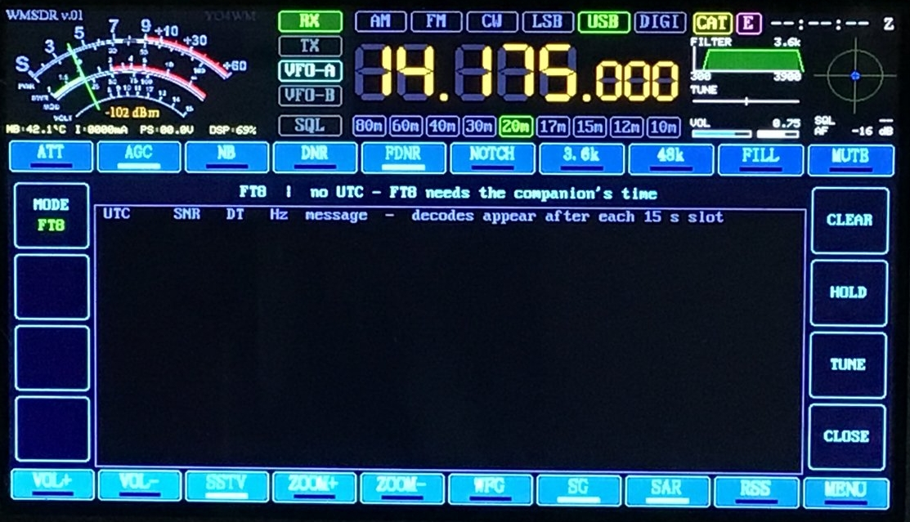

*Figure 7.3f — MODE FT8 with no UTC yet: the header says so until the companion supplies the time. Decodes appear after each 15 s slot.*

FT8 needs no tuning inside the window and no START: every transmission lasts 15 s and starts on a
UTC boundary (:00, :15, :30, :45), so the radio records each slot and decodes it when it ends.

**Two things it needs:**
- **UTC from the companion** (the **E** icon, §6.5). FT8 slots must start within a fraction of a
  second, and the radio has no clock of its own. Without it the status line reads
  `no UTC - FT8 needs the companion's time` and nothing is decoded.
- **12 kHz audio** — arranged by the window itself (see *Span* above).

1. Tune **USB** to an FT8 frequency (see *Where to listen*), e.g. **14.074 MHz**.
2. Open the window, MODE **FT8**.
3. The status line counts through `waiting for slot hh:mm:ss`, then `slot hh:mm:ss` while it
   records, then `decoding`. Decodes appear a few seconds after each slot ends.

The list shows the last 16 decodes, newest at the bottom:

```
UTC     SNR   DT   Hz  message
111415   -5 +0.1  822  CQ ON3URT JO10
111415  +11 +0.1 1706  KH8WW IW4EGP JN64
```

- The first line of each slot is **white**, the rest green, so slots read as groups.
- **SNR** is the decoder's own estimate. It is not calibrated like WSJT-X's, so compare stations
  with each other rather than with another program.
- **DT** is the station's timing within the slot. The radio measures its own audio delay from the
  busy slots and corrects it, so after a minute or two most stations sit near **0.0**; a station
  at +1 or +2 s has a clock of its own that is off.
- **Hz** is the audio frequency — where the station sits in the passband.
- **`<...>`** is a callsign sent only as a short code. The radio remembers the full calls it has
  heard, so these fill in (e.g. `<YL3KZ>`) once the station has appeared in full.

| Button | In FT8 |
|---|---|
| START, SLANT−/+ | not used (blank) — FT8 runs on its own UTC slots |
| **CLEAR** | clear the list |
| **HOLD** | freeze the list to read it; decoding continues |

The status line also shows the previous slot, e.g. `last 23 in 7010 ms`. Every decode, and a
summary per slot, is also written to the serial log.

**What to expect.** On a busy 20 m band, typically **15–27 decodes per slot**. The radio decodes
fewer than WSJT-X on a PC: the weakest signals, which WSJT-X digs out with several passes, stay
below what the ESP32-S3 can process in one slot.

> **Verified on the air — 14.074 MHz, September 2026:** 16–27 decodes per slot, every slot
> decoded, DT settled at about 0, hashed callsigns filling in within a few slots.

The decodes also appear live in a browser, where they can be filtered and saved (§7.4).

#### Where to listen

| What | Frequency | Mode | Notes |
|---|---|---|---|
| SSTV | 3.730–3.735 MHz | LSB | European evenings |
| SSTV | 7.165 MHz | LSB | busy at weekends |
| SSTV | 14.230 MHz (also 14.227, 14.233) | USB | the main worldwide frequency |
| SSTV | 21.340 / 28.680 MHz | USB | when the band is open |
| WeFax, DWD Pinneberg | dial **3853.1** kHz (carrier 3855) | USB | typically at night |
| WeFax, DWD Pinneberg | dial **7878.1** kHz (carrier 7880) | USB | day or night |
| WeFax, DWD Pinneberg | dial **13880.6** kHz (carrier 13882.5) | USB | typically by day |
| RTTY, amateur | 14.080–14.100 MHz | USB | 45.45/170; try REV |
| RTTY, DWD Pinneberg | dial **4581.1 / 7644.1 / 10099.1** kHz (carriers 4583 / 7646 / 10100.8) | USB | 50/450; confirmed on air on 10100.8 |
| RTTY, weather | dial **11037.3** kHz | USB | 50/450; confirmed on air |
| PSK31 | 14.070 MHz | USB | daytime |
| PSK31 | 7.040 / 3.580 MHz | USB | evenings |
| FT8 | **14.074** MHz | USB | the busiest; confirmed on air |
| FT8 | 7.074 / 3.573 MHz | USB | evenings and night |
| FT8 | 21.074 / 28.074 MHz | USB | when the band is open |

#### Self-test: TEST

With MODE on **TEST**, **START** plays a perfect synthetic Martin 1 picture straight into the
decoder — the receiver is not involved — with a deliberate +50 ppm clock error: header
`VIS 44 -> M1`, then 8 vertical colour bars (white, yellow, cyan, green, magenta, red, blue,
black); the slant settles near +50 ppm.

If it comes out right, the decoder is fine and any problem on the air is tuning or propagation.
The self-test runs slower than real time; that does not change the result.

#### Limits

- Nothing is saved on the radio — WeFax charts and FT8 decodes can be saved from a browser
  (§7.4); SSTV pictures, RTTY and PSK text cannot yet.
- SSTV: Martin 1 and Martin 2 only. WeFax: 120 lines/min, IOC 576 only. RTTY: Baudot (ITA2)
  only — no SITOR / NAVTEX. PSK: BPSK31 and BPSK63 only — no QPSK. FT8: receive only — no FT4,
  no transmit.
- The TEST mode is temporary and will be removed once SSTV has been verified on real signals.

---

### 7.4 Companion web pages (wmsdr-dx.local)

The radio has no storage and no keyboard. The companion XIAO — the board that already brings UTC
and DX spots over ESP-NOW — receives the decoded WeFax charts and FT8 decodes, keeps the latest
ones in its memory and serves them to any browser on your Wi-Fi; it also carries CW typed in the
browser to the radio. Saving happens in the browser, on your phone or PC.

Open **`http://wmsdr-dx.local/`**:

- **Home** is a dashboard with live tiles — UTC, FT8 (decodes in the last slot), Pictures, DX
  cluster, and the companion's Wi-Fi signal and uptime. Tap a tile to open its page.
- **☰** (top left, on every page) opens a drawer with all pages: Home, FT8, Pictures,
  **Transmit**, Control panel, RSS feeds, Settings, Status (JSON).
- **☀ / ☾** (top right) switches between a dark and a light theme; the choice is remembered in
  that browser.
- **Settings** holds the Wi-Fi, **CALLSIGN** and DX-cluster fields. Saving reboots the
  companion; leaving the password field empty keeps the stored one. In first-time setup (the
  `WMSDR-DX-Config` access point, 192.168.4.1) the settings form opens directly.

The live pages show **LIVE** while connected and reconnect by themselves.

**Needed:** the radio and the companion on current firmware, the companion on your Wi-Fi, and the
decoder window open in the mode concerned — the companion only receives while the radio decodes.

#### Pictures — `/fax.html`

- The WeFax chart **builds live** as it is received, row by row; **follow live** keeps the newest
  row in view.
- The last **2 charts** are kept until the companion restarts; click one in the list to show it.
  A page opened mid-chart loads what has been received so far.
- **Save PNG** saves the chart shown, named by date and time
  (e.g. `wefax_20260917_1029Z_3.png`).
- A chart is 640 pixels wide, as on the radio's screen.

> **Verified example — DWD Pinneberg, 7880 kHz:** dial **7878.1 kHz USB**, MODE **WEFAX**. The
> "Atlantic North: sea state" chart was received live in the browser and saved as PNG.

#### FT8 — `/ft8.html`

| Part | What it does |
|---|---|
| table | newest slot on top: UTC, SNR, DT, Hz, message |
| green message | a **CQ** |
| orange line | a message with **your call** — the **CALLSIGN** set on the companion's config page |
| **CQ only** / **my call only** | filters |
| search box | shows only messages containing a call or grid, e.g. `JN` |
| **Pause** | freezes the table to read it; decodes keep arriving, the button counts them, click again to jump to the latest |
| `last slot …: N decoded, M received` | the radio's count against what reached the page; **red** when they differ — decodes were lost on the link |
| **Save log** | downloads all stored decodes as a text file in WSJT-X `ALL.TXT` style |

The companion keeps the last **1000 decodes** until it restarts; reloading the page brings them
all back.

#### Transmit (CW) — `/tx.html`

Send CW from any browser — phone, tablet or PC. The radio keys the uSDX through its PTT line;
the page only types.

**The radio decides.** Nothing is sent unless **TX ARM** is on at the radio (MENU → TX, §8.11).
The badge at the top shows what the radio reports, once a second:

| Badge | Meaning |
|---|---|
| **RADIO NOT HEARD** | no status from the radio for 4 s — link or radio down |
| **NOT ARMED** | the radio refuses text; arm it at the radio |
| **ARMED** (orange) | ready |
| **SENDING** (red) | keying, with the characters still queued |

**Live keying** (on by default) sends every character **as you type it** — no Enter, so there
are no gaps for another station to jump into.

- **Enter** types a space.
- **Backspace** takes back letters the radio **has not started** yet; letters already on air
  cannot be recalled.
- Only characters CW can send are accepted: A–Z, 0–9, `. , ? / = + - @`, and prosigns in angle
  brackets — `<AR> <SK> <BT> <KN> <AS> <HH>` (a prosign goes out once its `>` is typed).
- If you type slower than the keyer, the over **hangs 1.5 s** between words (sidetone on,
  receive muted) instead of ending after every word.
- It works from phone keyboards too.

With live keying off, type a whole line and press **Enter** or **Send**.

- **Speed** — the WPM slider (5–60) follows the radio and changes it when released.
- **Macros** — CQ, QRZ?, RST, 73 `<SK>`, MY CALL, AGN?; `{CALL}` is replaced by the CALLSIGN from
  Settings. *edit macros* changes them (`Label | text`, one per line, saved in that browser).
- **STOP** (or **Esc**) stops at once and clears whatever is still queued.
- **Sent** logs what went out, and in red anything refused because the radio was not armed.

> **Verified on the air (September 2026):** live typing to 45 WPM, clean on the sidetone and on a
> second receiver.

#### If a page stays empty

- **LIVE but nothing appears:** is the decoder window open in WEFAX / FT8 on the radio?
- **FT8 shows `N decoded, M received` in red often:** the ESP-NOW link is losing frames — move the
  companion closer or improve its antenna.
- **The companion cannot join the Wi-Fi at all** — it sees networks in a scan but connects to
  none, not even its own `WMSDR-DX-Config` access point: check its **antenna** first (the small
  snap-on connector comes loose easily), then its USB power. This happened on the prototype; a
  better antenna cured it.
- **Transmit shows RADIO NOT HEARD** after the router changed Wi-Fi channel: current companion
  firmware follows the channel by itself; older firmware needed a companion reboot. Fixing the
  router on one channel (11 is what WMSDR listens on first) avoids the search altogether.

---

## 8. The menu, tab by tab

Press **MENU** on the bottom row. The overlay covers the spectrum, waterfall, frequency
scale and decoder line — the button rows stay live, so **MENU** closes it again.

**Twelve tabs:** DISPLAY · SPECTRUM · TRACE · DSP · AUDIO · EQ · CW · CALIB · COLORS · KNOBS · TX · STATUS

**How the controls work**

- **Cells** with an LED bar are on/off. One tap toggles.
- **Numeric rows** have `−` and `+` buttons with the value between them. The buttons grey
  out at the end of travel. **Press and hold** to repeat: one step immediately, then
  repeats after 400 ms, then faster after 1.5 s.
- The **action button** at the bottom centre changes meaning per tab — usually
  **RESET DEFAULTS**.

**How settings are saved**

Everything except the STATUS tab is written to flash as **one versioned record** (the TX tab
keeps its own record, and TX ARM is never saved), committed
when you **close** the menu — six changes are one write, and no change is no write at all.
Settings changed outside the menu (the `WFG`, `SG`, `SAR`, `FILL`, `VOL` buttons, the SQL
tap) are caught by a deferred autosave that fires 3 seconds after the last change.

> **RESET DEFAULTS is load-bearing, not a convenience.** Several of these values are
> persisted *and* capable of making the display unreadable — a spectrum floor that pushes
> the trace off the window, a text colour set to its own background. Once stored, a power
> cycle no longer rescues you. The reset button is the way back, and the min/max limits on
> each row are the other half of that guard.

---

### 8.1 DISPLAY tab

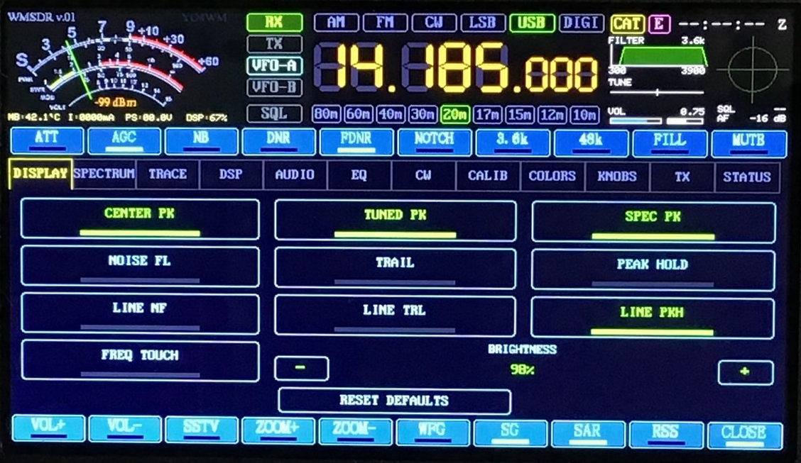

*Figure 8.1 — DISPLAY tab.*

A 3 × 4 grid of on/off cells plus one numeric control. Everything here is about **what is
drawn on the spectrum**, not about the DSP.

| Cell | What it controls |
|---|---|
| **CENTER PK** | Marker on the centre (LO) frequency |
| **TUNED PK** | Marker on the tuned frequency |
| **SPEC PK** | Marker on the strongest peak in the span |
| **NOISE FL** | Draw the tracked noise-floor layer |
| **TRAIL** | Draw the decaying trail layer |
| **PEAK HOLD** | Draw the peak-hold layer |
| **LINE NF** | Noise floor as a line (on) or filled (off) |
| **LINE TRL** | Trail as a line or filled |
| **LINE PKH** | Peak hold as a line or filled |
| **FREQ TOUCH** | **May a tap on the panadapter retune the rig?** With this off, the cursor still tracks your finger but no CAT set is sent. Turn it off if you are afraid of a stray touch during a contest. |

| Control | Range | Notes |
|---|---|---|
| **BRIGHTNESS** | 20 – 255, step 5, shown as % | Panel backlight. The minimum is deliberately **not** 0: a backlight you can take to black would hide the very menu you need to bring it back. |

**Action:** RESET DEFAULTS.

---

### 8.2 SPECTRUM tab

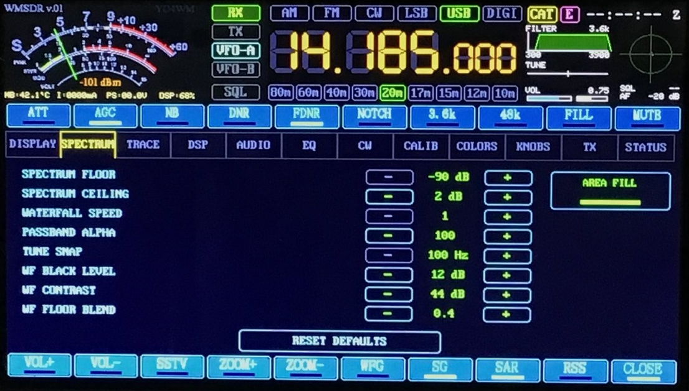

*Figure 8.2 — SPECTRUM tab.*

The display window and the waterfall's colour mapping.

| Row | Range | Unit | What it does |
|---|---|---|---|
| **SPECTRUM FLOOR** | −90 … −20, step 1 | dB | Lower clamp on the auto-ranging display window. Signals below this are at the bottom of the screen. |
| **SPECTRUM CEILING** | −20 … +40, step 1 | dB | Upper clamp. Together with FLOOR, these bound how far the automatic range is allowed to travel — they are **not** the live window, which is recomputed every frame. |
| **WATERFALL SPEED** | 1 … 5, step 1 | — | Scroll rate. 1 is slowest and shows the longest history. |
| **PASSBAND ALPHA** | 0 … 255, step 4 | — | Opacity of the translucent passband mask over the spectrum. 0 makes it invisible — if you cannot see your passband, look here first. |
| **TUNE SNAP** | 100 … 1000, step 100 | Hz | Rounding applied to tap-to-tune. 100 for casual work, 500 or 1000 to land cleanly on a net frequency. |
| **WF BLACK LEVEL** | 0 … 30, step 1 | dB | How far above each bin's own noise floor the waterfall starts to show colour. Raise it to darken a noisy band. |
| **WF CONTRAST** | 10 … 80, step 2 | dB | The dB span that the palette is stretched across. Small = punchy and easily saturated; large = gentle. |
| **WF FLOOR BLEND** | 0.0 … 1.0, step 0.1 | — | How much of the **per-bin** floor is used versus one global floor. **0 collapses the scheme to a single global floor** — try that first if the waterfall ever looks wrong. |

| Cell | What it does |
|---|---|
| **AREA FILL** | Fills the area under the spectrum trace |

**Action:** RESET DEFAULTS.

---

### 8.3 TRACE tab

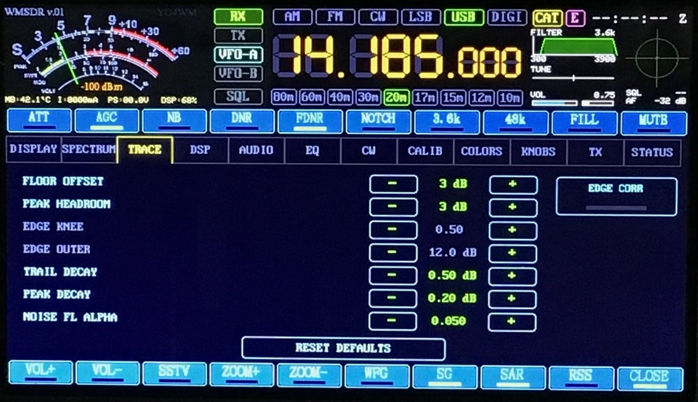

*Figure 8.3 — TRACE tab.*

The shape of the trace itself. These are tuned on the air against real band conditions,
which is why they are persisted — and why the reset button matters here.

| Row | Range | Unit | What it does |
|---|---|---|---|
| **FLOOR OFFSET** | −30 … +40, step 1 | dB | Shifts the whole trace vertically. **The one to be careful with**: a large value pushes the trace clean off the visible window, and once stored a power cycle no longer clears it. |
| **PEAK HEADROOM** | 0 … 30, step 1 | dB | How much room is left above the strongest peak. |
| **EDGE KNEE** | 0.10 … 1.00, step 0.05 | — | Where the edge correction starts, as a fraction of half-span. *Greyed out unless EDGE CORR is on.* |
| **EDGE OUTER** | 0.0 … 30.0, step 0.5 | dB | How much correction is applied at the extreme edges. *Greyed out unless EDGE CORR is on.* |
| **TRAIL DECAY** | 0.05 … 3.00, step 0.05 | dB / frame | How fast the trail fades. Small = long tail. |
| **PEAK DECAY** | 0.01 … 3.00, step 0.05 | dB / frame | How fast peak hold falls back. Very small values effectively make it a permanent maximum. |
| **NOISE FL ALPHA** | 0.002 … 0.200, step 0.005 | — | How fast the tracked noise floor follows the band. Small = slow and stable; large = follows QSB and can swallow a weak steady carrier. |

| Cell | What it does |
|---|---|
| **EDGE CORR** | Enables the edge correction. The two EDGE rows are only live while this is on — greyed out otherwise, so they do not read as working controls that silently do nothing. |

**Action:** RESET DEFAULTS.

---

### 8.4 DSP tab

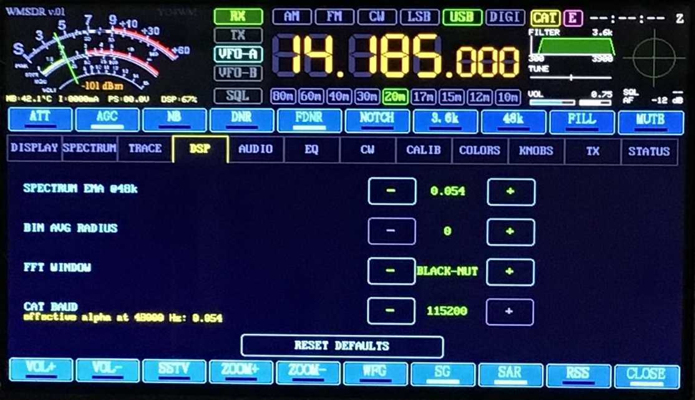

*Figure 8.4 — DSP tab. Photographed before the IQ BALANCE rows were added.*

The spectrum smoothing chain, ahead of everything the other display tabs adjust — plus
the CAT baud rate, which had to live somewhere reachable without a rebuild.

| Row | Range | What it does |
|---|---|---|
| **SPECTRUM EMA @48k** | 0.004 … 0.300, step 0.002 | Exponential smoothing on the spectrum magnitudes, expressed at 48 kHz. Small = smooth and slow; large = twitchy and responsive. The tab prints the **effective alpha at the current sample rate** underneath, because the value scales with the rate and you should not have to do that arithmetic. |
| **BIN AVG RADIUS** | 0 … 4, step 1 | Averages each bin with its neighbours. 0 = off. Trades frequency resolution for a smoother-looking trace. |
| **FFT WINDOW** | list | The **display** FFT window: BLACKMAN-H · NUTTALL · BLACK-NUT · HANN · HAMMING · NONE. Listed low-sidelobe first, so moving down the list trades dynamic range for resolution. **Levels do not move between choices** — every window is gain-normalised to the Blackman-Harris reference, so the S-meter calibration stays valid whichever you pick. This is display-only; the receive chain has no FFT. |
| **CAT BAUD** | 9600 / 38400 / 115200 | The CAT serial rate. Applied to the live UART immediately, and restored before the port is opened at boot. Set it to match the rig. |
| **IQ BALANCE** | OFF / AUTO / MAN | Corrects the gain and phase mismatch between the I and Q channels, which otherwise leaks a mirror copy of every signal to the other side of centre. **AUTO** (default) measures it continuously from whatever is on the band and settles in a few seconds; it is frozen while you transmit. **MAN** applies the two rows below as set. **OFF** applies nothing. Corrects the spectrum and the audio alike. |
| **IQ GAIN** | −3.00 … +3.00 dB, step 0.05 | The **board's** gain imbalance (Q against I), not the correction. Live in AUTO — the tab refreshes on its own. Stepping it while in AUTO switches to MAN, starting from the measured value. |
| **IQ PHASE** | −10.0 … +10.0 deg, step 0.1 | The board's phase error away from 90°. Same behaviour as IQ GAIN. |

**Reading the IQ rows.** A well-matched front end shows a few tenths of a dB and under a degree —
about 40 dB of mirror rejection before any correction. To null a mirror by hand: put a steady
carrier a few kHz off centre, switch to MAN, step IQ PHASE for the smallest mirror, then IQ GAIN.
The mode and both values are kept across power cycles, so AUTO starts from the last known
balance instead of zero.

**Action:** RESET DEFAULTS (also returns IQ BALANCE to AUTO, 0 dB, 0°).

---

### 8.5 AUDIO tab

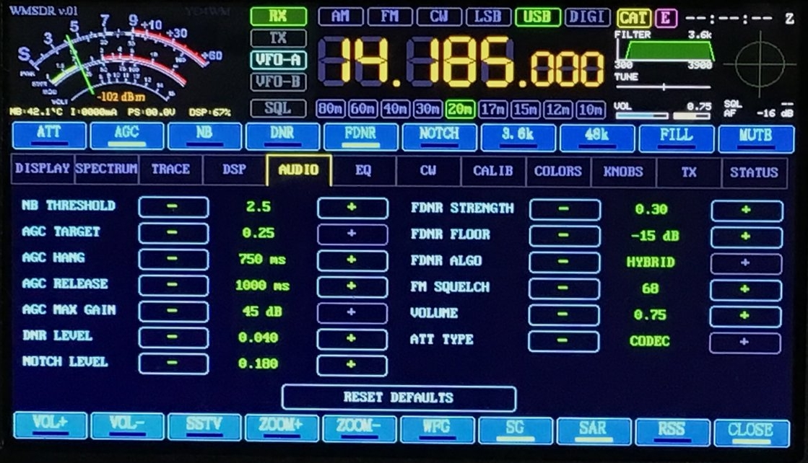

*Figure 8.5 — AUDIO tab.*

The receive audio chain — the part you actually listen to.

| Row | Range | Unit | What it does |
|---|---|---|---|
| **NB THRESHOLD** | 2.0 … 10.0, step 0.5 | — | The impulse noise blanker's trigger point. **The most consequential setting on this tab**, because both failure modes are quiet: too high and the NB button does nothing at all; too low and it shaves the tops off voice peaks and CW keying, which sounds like mild roughness rather than a malfunction. The right value depends on the noise at your QTH. |
| **AGC TARGET** | 0.05 … 0.25, step 0.05 | — | The *average* output level the AGC aims for; default 0.20. Speech peaks run about three times higher, which is why the range stops at 0.25 — see the headroom note below. |
| **AGC HANG** | 0 … 1000, step 50 | ms | How long the gain holds after a peak before it starts to recover. Longer suits SSB voice; shorter suits CW. |
| **AGC RELEASE** | 100 … 2000, step 100 | ms | How fast the gain recovers after the hang expires. |
| **AGC MAX GAIN** | 0 … +45, step 3 | dB | Ceiling on the AGC gain; default **+34 dB**. In practice it decides **how loud the band noise gets in the pauses** compared with voice: at +34 dB the pause noise sits about 12 dB below the voice, at +45 dB it comes up nearly to speech level. Every step is audible; above about +42 dB the ceiling stops mattering on typical band noise. |
| **DNR LEVEL** | 0.005 … 0.200, step 0.005 | — | NLMS step size for the adaptive noise reducer. Higher tracks faster but roughens the audio; on voice, **"watery"** is the usual sign to back it off. |
| **NOTCH LEVEL** | 0.005 … 0.200, step 0.005 | — | NLMS step size for the automatic notch. Higher grabs a carrier faster but is more likely to chew on speech. |
| **FDNR STRENGTH** | 0.00 … 1.00, step 0.05 | — | How aggressively the spectral NR suppresses each bin. |
| **FDNR FLOOR** | −24 … −3, step 1 | dB | How far down a bin is allowed to go. **If FDNR sounds like burbling rather than like quiet noise, move this UP (towards −3), not down.** Silencing bins completely is what creates musical noise; leaving an audible bed is what makes the residual sound natural. |
| **FDNR ALGO** | MIN-STAT / ROMANIN / **HYBRID** | — | Which noise-reduction engine the FDNR button switches on. **HYBRID is the default and there is no reason to move off it** — the other two are kept as reference points, so you can hear for yourself what each half of the algorithm contributes. See §8.5.1. Not saved: it returns to HYBRID at every power-up. |
| **FM SQUELCH** | 0 … 100, step 1 | — | FM only, ignored everywhere else. **0 = open** (the squelch does nothing), 1 = loosest, 100 = tightest. It gates on the hiss *above* the audio band, so the number is a **noise tolerance**, not a signal level — turn it up until an empty channel stays quiet, and stop there. Measured reference: about 0.17 on an empty channel, about 0.008 when fully quieted. |
| **VOLUME** | 0.05 … 1.00, step 0.05 | — | Output level after the AGC — an attenuator only, it never adds gain. The same value as VOL+ / VOL− on the bottom row. |

> **Headroom: keep AGC TARGET × VOLUME at or below 0.25.** The AGC holds the *average* level;
> speech peaks run about three times above it, and above a product of about 0.28 they reach the
> output ceiling. That is heard as distortion that sounds like **reverb or echo**, worst in the
> pauses — and no AGC, noise or filter setting fixes it. The ranges above make it impossible to
> cross (0.25 × 1.00), and settings saved by older firmware are pulled into range at power-up.
> The `AF` readout (§6.8) shows where you are: about −6 dB on voice is healthy, −2 … 0 dB is
> too hot.
>
> **The FILTER bandwidth is deliberately not on this tab.** It is a per-mode list already
> shown as the FILTER button's own label; a numeric row here could only offer a bare index,
> which is worse than what the button already does.
>
> **FDNR on/off is the FDNR button**, not a row — it is a per-QSO control, and rows are
> expensive on this tab because every row's height is derived from the count.

**Action:** RESET DEFAULTS.

#### 8.5.1 The three FDNR engines

Spectral noise reduction makes two decisions that are usually bundled together but are in
fact independent: **how it estimates the noise**, and **how it treats the resulting per-bin
gains**. WMSDR lets you hear each one separately, because the combination that works best
is not the one either source algorithm arrived at on its own.

| Choice | Noise estimate | Gain treatment | How it sounds |
|---|---|---|---|
| **MIN-STAT** | Running minimum of each bin's power over about 1.5 s. Signals come and go; the noise is the part that is always there, so the minimum is the noise. | Smoothed over time only. | Suppresses hardest — voice comes out clearest, residual noise lowest. But in the gaps between words it burbles: **a faint "radio station playing in the background".** |
| **ROMANIN** | Per bin, the probability that speech is present; the noise estimate moves only by the probability that it is *absent*. Reacts in tens of milliseconds instead of a second and a half. | Averaged across **neighbouring bins**, by an amount that widens the harder the filter is cutting. | No burbling at all, but the background noise is left noticeably louder. |
| **HYBRID** *(default)* | MIN-STAT's. | ROMANIN's. | MIN-STAT's depth of cut with none of its musical noise: the noise drops and stays down, whether or not anyone is talking. |

Why the burbling happens, and why HYBRID cures it: noise in a single FFT bin fluctuates by
many decibels from frame to frame even when the noise itself is perfectly steady. Set a
threshold and most bins fall below it while the occasional one spikes past and survives at
full gain. **Those isolated survivors ringing on their own are what musical noise *is*.**
Averaging each bin's gain across its neighbours cannot leave one standing alone. Smoothing
in time — which is all MIN-STAT does — cannot fix it, because a bin that survives in every
frame is perfectly steady in time and still a whistle.

The averaging is only applied when the filter is actually cutting hard, so audio on a quiet
band is never needlessly blurred.

> **Ignored in CW**, all three of them. FDNR adds about 21 ms of delay and softens the edges
> of keying — which is exactly what the CW decoder measures marks and spaces from.

---

### 8.6 EQ tab

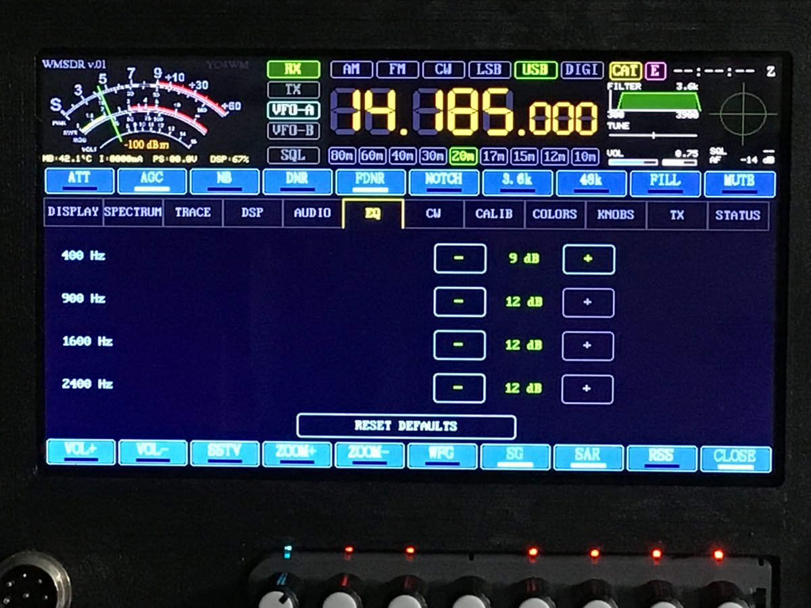

*Figure 8.6 — EQ tab.*

Four peaking bands on the demodulated audio.

| Row | Range | What it is for |
|---|---|---|
| **400 Hz** | −12 … +12 dB, step 1 | Bass / warmth. Cut it to fight rumble and LF noise. |
| **900 Hz** | −12 … +12 dB, step 1 | Body of the voice. |
| **1600 Hz** | −12 … +12 dB, step 1 | Presence. Lift it for intelligibility on a weak signal. |
| **2400 Hz** | −12 … +12 dB, step 1 | Top end. Lift for crispness, cut to tame hiss. |

The centres are fixed at 400 / 900 / 1600 / 2400 Hz — chosen to sit *inside* a
communications passband rather than on the ISO octave grid, so all four actually do
something on SSB.

At 0 dB a peaking section is an exact identity, so **a flat EQ is bit-transparent and is
skipped entirely** — leaving it flat costs nothing.

**Action:** RESET DEFAULTS.

---

### 8.7 CW tab

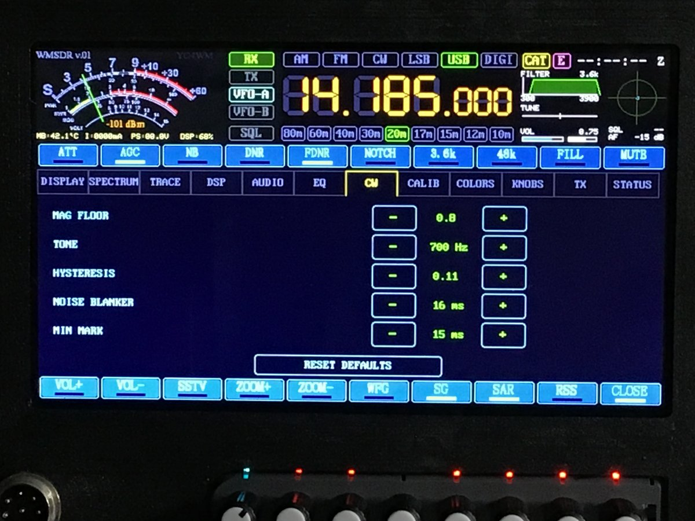

*Figure 8.7 — CW tab.*

Decoder tuning. The decoder text line on the main screen is your feedback, so every one of
these can be judged on the air.

| Row | Range | Unit | What it does |
|---|---|---|---|
| **MAG FLOOR** | 0.1 … 20.0, step 0.1 | — | The absolute magnitude below which the detector calls it silence. Too low and noise decodes as random characters; too high and weak signals are ignored. |
| **TONE** | 400 … 1000, step 10 | Hz | **The CW pitch for the whole radio**, not just the decoder. It re-centres the CW bandpass filter, moves the tuning aid, moves the spectrum marker, and sets the VFO offset — all from this one number. |
| **HYSTERESIS** | 0.02 … 0.45, step 0.01 | — | The symmetric gap between the on and off thresholds. Larger = more immune to noise flicker, but clips very fast keying. |
| **NOISE BLANKER** | 0 … 50, step 1 | ms | Ignores mark/space events shorter than this — impulse noise, not keying. |
| **MIN MARK** | 10 … 120, step 5 | ms | The shortest event accepted as a real dit. Sets the practical upper WPM limit. |

The BPF bandwidth is **not** a row here: the decoder's pre-filter follows the **FILTER**
button, so a separate control could only ever contradict it. Pick the CW bandwidth on the
front panel and the decoder tracks it.

The defaults are the values calibrated on the air; RESET DEFAULTS returns to those.

**Action:** RESET DEFAULTS.

---

### 8.8 CALIB tab

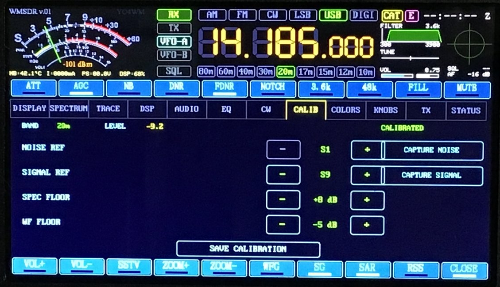

*Figure 8.8 — CALIB tab.*

Per-band S-meter and display-floor calibration. Flat controls, no wizard — every field and
both capture buttons are always live, so you can redo a single point without walking a
whole flow.

The header line shows the current **BAND**, the **live LEVEL** being measured (refreshed
four times a second), and whether this band reads **CALIBRATED** or **UNCALIBRATED**.

| Row | Range | What it does |
|---|---|---|
| **NOISE REF** | S1 … S15 | The S-number you want the *quiet* reference point to read as. |
| **SIGNAL REF** | S1 … S15 | The S-number you want the *strong* reference point to read as. |
| **SPEC FLOOR** | −30 … +30 dB | Per-band spectrum floor offset — lines the trace up across bands with different noise levels. |
| **WF FLOOR** | −30 … +30 dB | Per-band waterfall floor offset, same idea. |

Two capture buttons sit on the two reference rows:

- **CAPTURE NOISE** — point the rig at a quiet part of the band, set NOISE REF (typically
  S1), press. The current level is stored as that S-number.
- **CAPTURE SIGNAL** — find a signal of known strength (or use a calibrated generator), set
  SIGNAL REF (typically S9), press.

Two points define the whole scale. Above S9 the scale continues at S9+10 dB per unit.

**Action:** **SAVE CALIBRATION.** The floor offsets are edited in place, so saving is a
deliberate step — press-and-hold on a row would otherwise write flash every few
milliseconds. The two CAPTURE buttons save on their own; the offsets do not.

---

### 8.9 COLORS tab

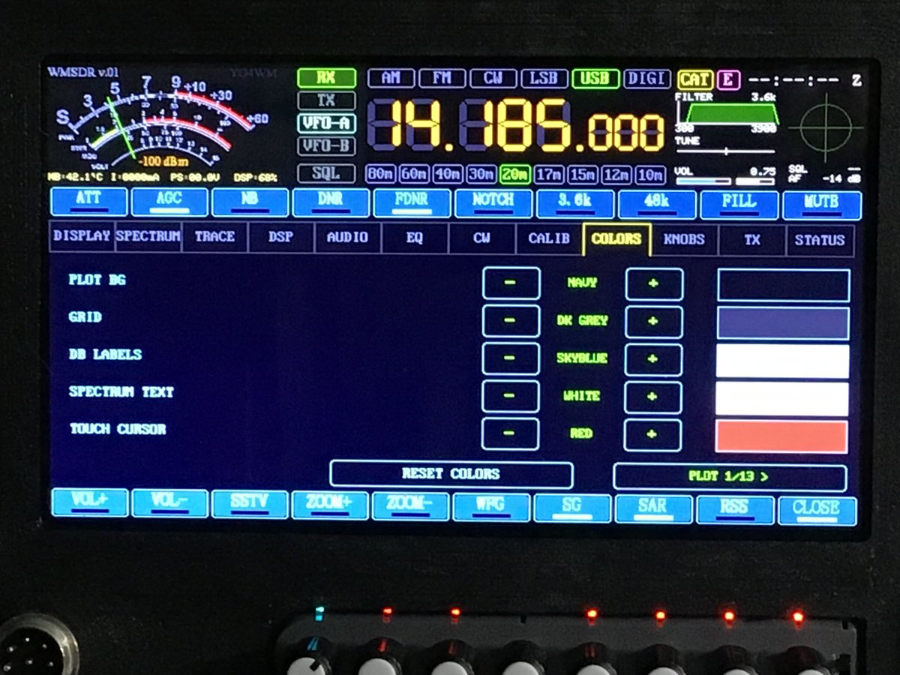

*Figure 8.9 — COLORS tab.*

Every colour in the UI is a themeable slot. There are more slots than fit one page, so the
tab shows one **group** at a time and the selector on the action line steps through them.

Each row shows the slot name, `−` / `+` to walk the palette, and a **swatch** — several
palette entries are hard to tell apart by name on a dim panel, and the swatch is the only
honest preview for a slot whose value is off-palette (shown as hex). The palette wraps, so
there is no end of travel.

Where you left the group selector is not persisted; the colours themselves are.

**Action:** **RESET COLORS.** Also load-bearing: the palette contains BLACK, so it is
entirely possible to set a text slot to its own background and lose the ability to read the
tab you would need to undo it. This resets **every** slot, including those on other groups.

---

### 8.10 KNOBS tab

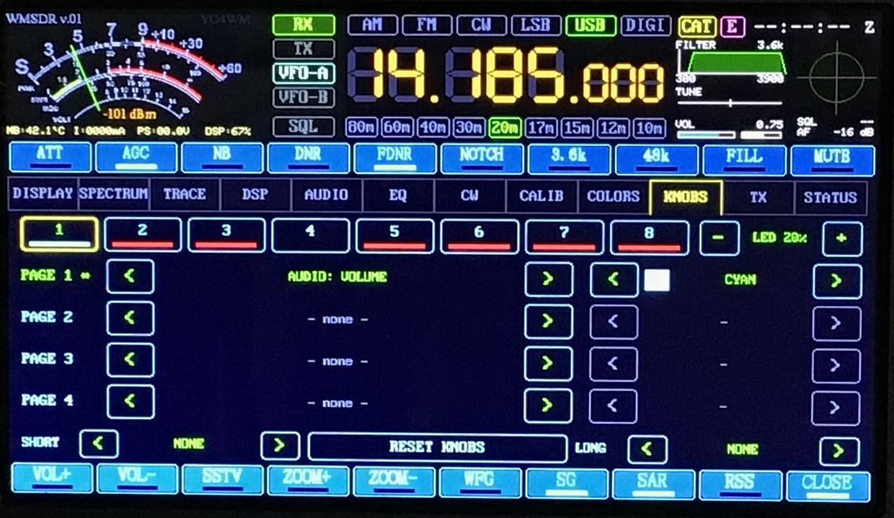

*Figure 8.10 — KNOBS tab.*

Assigns the optional **8Encoder** knob unit (§2). Without the unit fitted the tab still works
and the settings are kept, ready for when it is plugged in.

**How the knobs behave**

- **Turning** a knob moves one setting by **one menu step per click** — exactly as the `−` /
  `+` buttons of that setting's own tab would, with the same limits. With that tab open, the
  value on screen follows the knob.
- Each knob has up to **four pages**. A page is one setting plus an **LED colour**; the knob
  always drives its current page, and its LED shows which page that is. This is how one knob
  can cover a whole group — the default AGC knob is `AGC TARGET` (red), `AGC HANG` (green)
  and `AGC RELEASE` (blue).
- Each knob's push button knows two presses: **short** (released before 0.6 s) and **long**
  (fires at 0.6 s, while still held — you do not need to let go). The LED flashes **white** on a
  short press and **orange** on a long one, so you can see a press was taken.
- The **toggle switch** on the unit arms or inhibits all eight knobs. Inhibited, the knob LEDs
  go dark and turns and presses are ignored — use it so a stray hand cannot change a setting
  mid-QSO.
- Pages always start on **page 1** after power-on.

**The tab, top to bottom**

| Area | What it does |
|---|---|
| **1 … 8** | Selects the knob to edit. The bar under each number is that knob's live LED colour. **Turning or pressing a physical knob while this tab is open selects it here** — and does nothing else, so setting up cannot change a value by accident. |
| **LED − / +** | Master brightness of all the unit's LEDs, **5 – 100 %**, step 5, default **30 %**. The steps are perceptual, not linear, so the low end is usable at night. The minimum is not 0: the switch is how the LEDs go dark. |
| **PAGE 1 … 4** | `<` / `>` on the left walk the list of settings: `- none -`, then every numeric setting on the SPECTRUM, TRACE, DSP, AUDIO, EQ and CW tabs, shown as `TAB: SETTING`. Press and hold to scroll. `<` / `>` on the right pick the LED colour: RED, ORANGE, YELLOW, GREEN, CYAN, BLUE, PURPLE, MAGENTA, WHITE. The live page is marked `*`. |
| **SHORT < >** | What a short press does: **NONE**, **NEXT PAGE** or **PREV PAGE**. |
| **LONG < >** | The same choice for a long press. |

Editing a page makes it the knob's current page, so the knob's LED on the unit previews the
colour as you step through it.

A page showing **`? MISSING`** points at a setting a firmware update renamed or removed. It
does nothing; pick another setting for it.

CALIB settings cannot be put on a knob: they are only kept through **SAVE CALIBRATION**, so a
knob there would move a value that silently reverts at the next power cycle.

**Defaults**

| Knob | Pages | Short press |
|---|---|---|
| 1 | VOLUME (green) | — |
| 2 | AGC TARGET (red) · AGC HANG (green) · AGC RELEASE (blue) | NEXT PAGE |
| 3 | NB THRESHOLD (orange) | — |
| 4 | DNR LEVEL (magenta) | — |
| 5 | FDNR FLOOR (purple) | — |
| 6 | FM SQUELCH (yellow) | — |
| 7 | CW TONE (red) | — |
| 8 | WF CONTRAST (cyan) | — |

**Saving.** Knob assignments and LED brightness are saved like every other setting — on menu
close or by the 3-second autosave — but as their own records, so a firmware update that
changes the main settings record does not lose your knob setup (and the reverse).

**Action:** **RESET KNOBS.** Restores the default assignments above. It touches nothing else —
not the values the knobs control, not the LED brightness.

---

### 8.11 TX tab

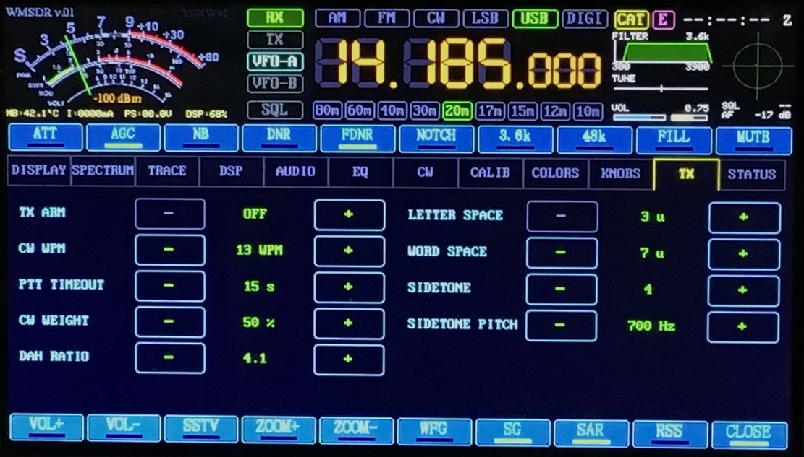

*Figure 8.11 — TX tab.*

Transmit settings. **Nothing transmits while TX ARM is OFF**, whatever asks for it.

| Row | Range | What it does |
|---|---|---|
| **TX ARM** | OFF / ARMED | Allows transmitting. **Never saved — every boot starts OFF.** While armed the TX lamp has an orange outline (§6.2). Switching OFF drops PTT at once and stops a CW over. |
| **CW WPM** | 5–60 | Keyer speed (PARIS). Also set from the browser Transmit page. |
| **PTT TIMEOUT** | 5–120 s | The longest a single key-down may last; PTT is then forced off (logged as `PTT TIMEOUT`). In CW every dit and dah is its own key-down. |
| **CW WEIGHT** | 25–75 % | Mark length against the gap after it. 50 % is standard; heavier sounds fuller and carries better on a weak or fading path, lighter sounds crisper. Speed is unchanged. |
| **DAH RATIO** | 2.5–4.5 | Dah length in dits (standard 3.0). |
| **LETTER SPACE** | 3–6 units | Gap between letters (standard 3). |
| **WORD SPACE** | 5–14 units | Gap between words (standard 7). |
| **SIDETONE** | 0–10 | CW monitor level in the WMSDR audio; 0 = off. |
| **SIDETONE PITCH** | 300–1200 Hz | Sidetone pitch — its own setting, independent of TONE on the CW tab. |

Everything except TX ARM is saved, in its own record (a menu RESET DEFAULTS does not touch it).

**PTT.** The line is the AW9523 expander pin P0_0 on the codec board, wired to the uSDX PTT: driven
**HIGH at standby, LOW while transmitting**. There is **no hand PTT input** — connect nothing else to
that line, because the pin actively drives it.

**CW transmit.** Text comes from the browser Transmit page (§7.4). The keyer times each element on
a microsecond timer and keys PTT directly, so element lengths stay exact to at least 45 WPM. The
uSDX, in CW mode, makes the carrier; no audio is involved.

**Sidetone.** Heard only in **CW mode while the keyer sends**. It replays the real PTT edges,
sample-accurate, with a small fixed delay, and **replaces receive audio** for the over; receive
audio comes back when the over ends. The WMSDR audio output also feeds the uSDX mic input, but in CW
mode the uSDX ignores the mic.

> **uSDX VOX must be OFF** once WMSDR's audio output is patched to the uSDX mic: that output carries
> receive audio between overs, and VOX would key the rig on it.

### 8.12 STATUS tab

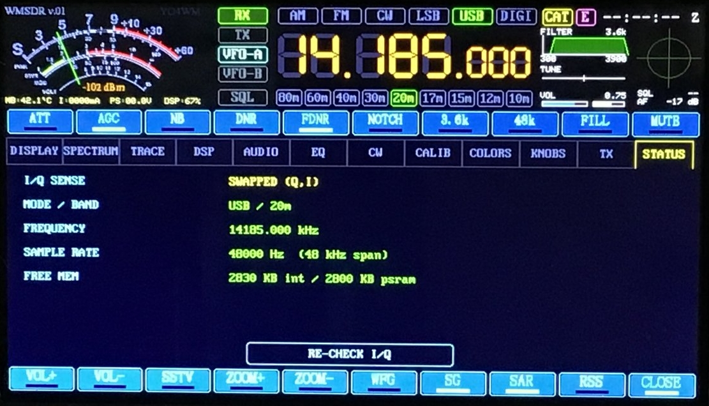

*Figure 8.12 — STATUS tab.*

Read-only diagnostics, refreshed twice a second.

| Row | What it tells you |
|---|---|
| **I/Q SENSE** | `STRAIGHT (I,Q)` (green) or `SWAPPED (Q,I)` (yellow), or `checking...` while detection runs. Either result is fine — WMSDR compensates. This is the fastest confirmation that the I/Q pair is actually arriving. |
| **MODE / BAND** | What the rig says, via CAT |
| **FREQUENCY** | The current LO, in kHz |
| **SAMPLE RATE** | The current rate in Hz, and the resulting span |
| **FREE MEM** | Free internal DRAM and free PSRAM, in KB |

**Action:** **RE-CHECK I/Q.** Re-arms the automatic sense detection. It runs from inside
the DSP frame, where the buffers it inspects are actually valid, so the result appears a
moment after the press. Use it after a mode change, a band change, or any time the
sideband looks reversed.

Nothing on this tab is persisted — a known state at boot is more useful here than a
remembered one.

---

## 9. Practical setup sequences

### Getting on the air the first time

1. `CAT BAUD` (DSP tab) to match the rig · check STATUS shows the frequency moving.
2. **RE-CHECK I/Q** on STATUS. Confirm on the air: tune the rig **down**, the carrier
   should move **right**.
3. `I/Q` button → pick a span. 48k is the general-purpose choice.
4. CALIB tab → CAPTURE NOISE at S1, CAPTURE SIGNAL at S9, **SAVE CALIBRATION**.
5. `FILTER` → 2.4k for SSB.
6. `AGC` on, `VOLUME` to taste — keep the `AF` readout around −6 dB on voice.

### The band is noisy

1. `NB` on. Watch the `NB <n>` count in the DSP log while setting `NB THRESHOLD` — near
   zero on a clean band is what you want.
2. Try `DNR` and `FDNR` **one at a time** on the same signal. They are different tools.
3. If FDNR burbles — a faint "radio station" in the gaps between words — check `FDNR ALGO`
   is on **HYBRID** first; MIN-STAT does this by design. If it burbles on HYBRID, raise
   `FDNR FLOOR` towards −3.
4. A steady het: `NOTCH`.

### The waterfall looks wrong

1. Set `WF FLOOR BLEND` to **0**. That collapses the per-bin scheme to a single global
   floor — roughly the classic look. If it looks right now, the per-bin tracking was the
   cause and `WF BLACK LEVEL` / `WF CONTRAST` are where to work.
2. Remember the menu suppresses the waterfall repaint — close it and wait for the old
   history to scroll off before judging anything.

### The display has gone unreadable

Open the menu, find the tab that owns the setting, press **RESET DEFAULTS** (or **RESET
COLORS** on the COLORS tab). A power cycle will *not* rescue you — these values are
persisted.

### Setting up a knob

1. Check the unit's switch is on — the knob LEDs are lit.
2. Menu → **KNOBS**. Turn the physical knob you want; its number is selected on screen.
3. **PAGE 1** → `<` / `>` to the setting, then pick a colour.
4. More than one setting on this knob? Fill **PAGE 2** onwards, and set **SHORT** (or **LONG**)
   to **NEXT PAGE**.
5. Close the menu and try it. Too bright or too dim? **LED − / +** on the same tab.

### Receiving an SSTV picture

1. Tune as for voice on an SSTV frequency (§7.3) — USB on 20 m, LSB on 40 / 80 m.
2. **SSTV** button → MODE **AUTO**, HOLD off.
3. **TUNE**: wait for the needle to rest on 1900 — a header is coming. Press TUNE again to
   watch the picture.
4. Nothing after the 1900? Press **START** as the picture begins.
5. **HOLD** to keep a finished picture.

### Receiving a weather chart

1. Tune DWD in USB, 1.9 kHz below the carrier (7878.1 kHz for 7880).
2. **SSTV** button → MODE **WEFAX**.
3. Wait for `start signal detected` and the phasing — or, mid-chart, press **START** and tap the
   chart's left margin.
4. Lines leaning? **SLANT±** first, then tap the margin again if needed.

### Receiving RTTY

1. Tune USB so the tones sit on the **M** / **S** markers of TUNE (DWD: dial 10099.1 kHz for
   10100.8, or 11037.3 kHz).
2. **SSTV** button → MODE **RTTY**; tap the status line for the preset (DWD **50/450**, amateur
   **45.45/170**).
3. Garbage on a clean signal? **REV**.
4. Let the AFC settle; **CLEAR** empties the console, **HOLD** freezes it.

### Receiving FT8

1. Check the **E** icon is lit — FT8 needs the companion's UTC.
2. Tune **14.074 MHz USB** (or another FT8 frequency, §7.3).
3. **SSTV** button → MODE **FT8**. Decodes appear after the first full 15 s slot.
4. To read at leisure: **HOLD** on the radio, or open `wmsdr-dx.local/ft8.html` and use
   **Pause**, the filters and **Save log** (§7.4).

### Sending CW

1. uSDX on a dummy load or the antenna, **CW mode**, **VOX off**.
2. MENU → **TX** → **TX ARM → ARMED**. Set CW WPM and SIDETONE. Close the menu — the TX lamp is
   outlined orange.
3. Open `wmsdr-dx.local` → ☰ → **Transmit**. The badge shows **ARMED**.
4. Type — each character goes out as you type it. Macros for CQ / RST / 73. **STOP** or **Esc**
   stops at once.
5. Done: **TX ARM → OFF**.

---

## 10. Annexes

### Annex A — Interface board schematic

*To be inserted.*

Covers: I/Q input conditioning and level setting into the WM8731 line inputs, CAT level
translation between the rig and the ESP32-S3 UART, the audio output stage, and the supply
arrangement.

### Annex B — Proposed enclosure

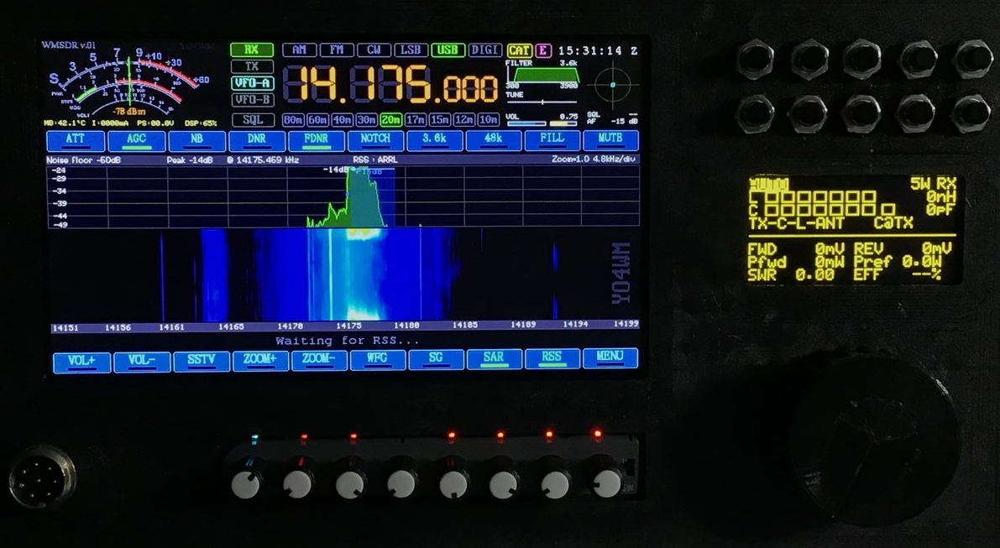

*Figure B.1 — Enclosure front panel: touch panel, eight-encoder unit with LED indicators, tuning knob, ATU display (separate unit), round multi-pin connector bottom left. See also Figures 1 and 2.*

Dimensioned drawings: *to be inserted.*

### Annex C — Reference tables

*To be inserted.*

Suggested: pinout summary, default values for every menu row, and a one-page quick
reference card for the two button rows.

---

*WMSDR — YO4WM. Presented at Cavaillon, October 2026.*
